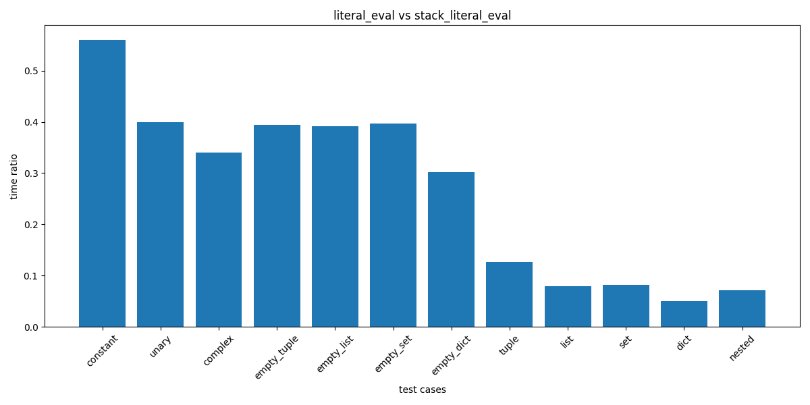

# Stack-based `ast.literal_eval`

## Purpose

### Avoiding Recursion Errors

~~Using a stack to implement `literal_eval` can avoid `RecursionError`.~~

I realized that this error was caused by the C implementation, not Python, so this approach was not effective in avoiding the error.

### Removing Unnecessary Closures

Related to a closed issue [#75934](https://github.com/python/cpython/issues/75934).

## Running Tests

The tests are copied from the CPython main branch, retaining only those related to `ast.literal_eval`. To run the tests, use the following command:

```sh
pytest
```

## Benchmark Results

Below are the benchmark results comparing `ast.literal_eval` and `stack_literal_eval`, conducted on an Intel(R) Core(TM) Ultra 9 185H using Python 3.12.6 release.

### timeit

To run the benchmark with simple `timeit`, use the following command:

```sh
./timeit_benchmark.sh
```



For detailed timings, refer to the [benchmark results](resources/benchmark.txt).


### pyperf

To run the benchmark with  `pyperf`, use the following command:

```sh
./pyperf_benchmark.sh
```

For the comparison results, refer to [compare_to.txt](resources/compare_to.txt).